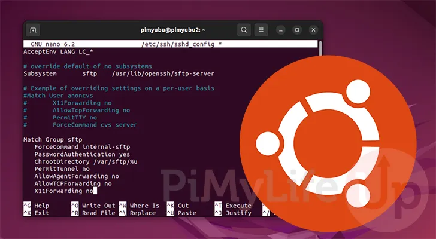
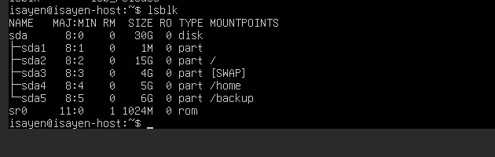
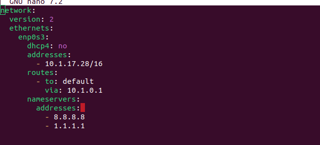

# DEEP-IN-SYSTEM

## overview 
Deep-in-system is a project that provides hands-on experience in Linux system administration by guiding you through the setup and configuration of an Ubuntu Server environment. You will configure networking, security, users, services, and backups, gaining practical skills required to manage and secure a production-like Linux server.

## Learning Objectives
- Install and configure an Ubuntu Server with custom disk partitioning.
- Manage users, permissions, and authentication mechanisms securely.
- Configure networking, firewalls, and SSH access following security best practices.
- Deploy and secure common Linux services such as FTP, MySQL, and WordPress.
- Implement automated backup strategies using cron jobs and system tools.

## 
### Step1: The Virtual Machine
The first thing to do is to Download the latest version of Ubuntu Server: [Ubuntu Server LTS](https://ubuntu.com/download/server).

- **Ubuntu Server**: Ubuntu Server is designed to run in the background to serve data to other computers (usually over a network). The difference between Desktop and Server versions is in what comes pre-installed and how you interact with it:
    - The Interface (GUI vs. CLI)
    - Resource Usage
    - Pre-installed Software

After installing the server, we must divide our VM disk into these partitions:

swap: 4G /: 15G /home: 5G /backup: 6G

**So, we have two main ways:** 
- During OS installation (recommended): After choosing your image, check the "Skip unattended installation" option and run the VM to start the installation.
        In the "Guided storage configuration" section, select "Custom storage layout." From here, you are free to divide your disk as you wish. 
- After installation (more flexible but needs care): [WATCH](https://www.youtube.com/watch?v=Qvi7bu2gn0g).

Result:



### Step2: The Network
By default, the VM obtains its IP address dynamically from a DHCP server. With the network interface configured in NAT mode, outbound connectivity is handled through the host’s network stack using address translation, allowing the VM to access external networks without additional configuration.

In our use case, the requirement is for the server to be directly reachable on the same Layer 2 network as the host. To achieve this, the network mode is switched from NAT to Bridged. In Bridged mode, the VM is attached directly to the physical network interface of the host, effectively behaving as an independent device on the network.

Additionally, the system configuration directory /etc/ contains the majority of system-wide configuration files. For network configuration Netplan is commonly used.

Within /etc/netplan/*.yaml, you will find YAML configuration files that define the network interfaces, including IP addressing, gateways, DNS, and routing. These files can be customized to match the required network setup, whether using DHCP or static addressing.



After modifying a Netplan configuration file, the changes must be applied using:

```
sudo netplan apply
```

### Step3: The Security

To improve the security of our server, we disable root login over SSH. Instead, we use **sudo**. Sudo allows users to run specific commands with higher privileges only when needed, instead of giving full root access all the time.

We also change the default SSH port from 22 to 2222. The SSH configuration file is located in: ```/etc/ssh/sshd_config```. In this file, we can modify the port and other SSH settings.

Next, we configure the firewall. The goal is to block all incoming traffic by default and only allow the necessary ports.

Run:
```
sudo ufw default allow outgoing
```
and:
```
sudo ufw default deny incoming
```
This setup allows all outgoing traffic and blocks all incoming traffic unless we explicitly allow it (for example, SSH on port 2222).

### Step4: User Management 